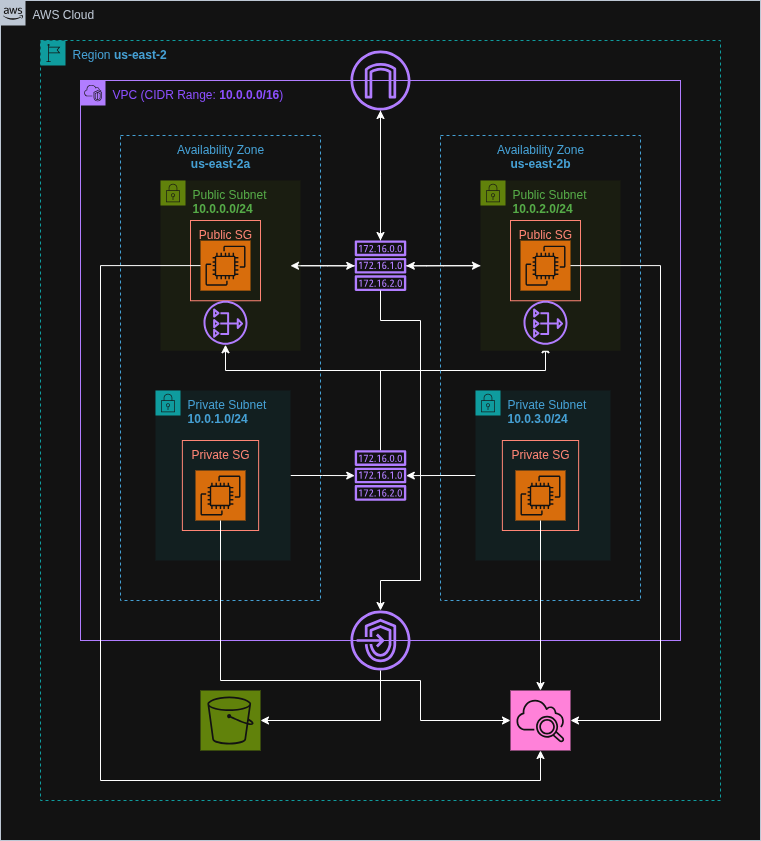

# AWS Custom VPC Infrastructure

Created a secure and scalable Virtual Private Cloud (VPC) architecture using AWS Console, with a clear separation of public and private subnets, proper routing, NAT Gateway configuration, and traffic monitoring via VPC Flow Logs and AWS CloudWatch with long term storage in AWS S3.

## Architecture Diagram

## Features

- Custom VPC with user-defined CIDR block (e.g. **10.0.0.0/16**)
- Public and private subnets across multiple AZs (e.g. **us-east-2a & us-east-2b**)
- Internet Gateway for public subnet access
- NAT Gateway for internet access from private subnets
- Route tables and subnet associations
- Security groups and Network ACLs for fine-grained access control
- VPC Flow Logs for monitoring traffic (in **AWS CloudWatch**)
- VPC Endpoints for secure AWS service access (e.g. **to store logs in S3**)
- Elastic IPs for NAT and public resources
- Tags for cost and resource management
- End-to-end connectivity testing between subnets and to the internet

## Lessons Learned
- Understood AWS networking fundamentals including subnets, routing, NAT vs IGW
- Learned best practices in subnet isolation and security controls
- Explored VPC Endpoints for private AWS service access

## Further Optimizations
- Use Terraform to help with Version Control, Modularity and Automation