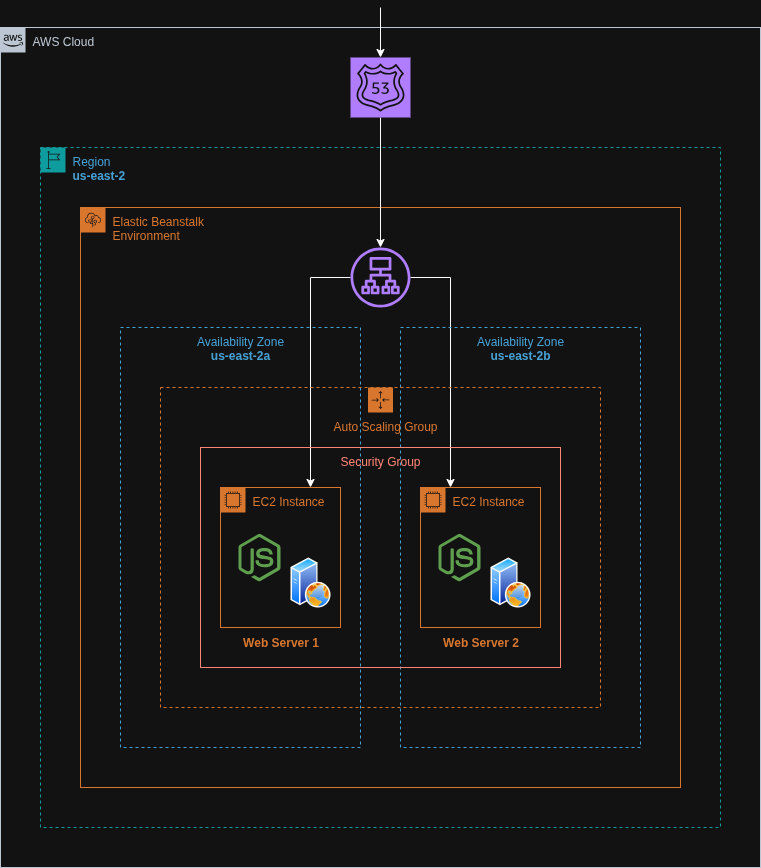

# Simple Node.js Deployment on AWS Elastic Beanstalk (AWS Console)

A beginner-friendly guide for deploying a basic Node.js application to AWS Elastic Beanstalk using the AWS Management Console. This method does not require Terraform or CLI tools and is ideal for small projects or learning purposes.


## Architecture Diagram




## Live Access

Once deployed, the application will be accessible via a public URL provided by Elastic Beanstalk (e.g., `http://<env-name>.<region>.elasticbeanstalk.com`).


## Features

- No infrastructure code needed
- Deploy directly from your ZIP package using the AWS Console
- Environment managed by Elastic Beanstalk
- Simple scaling and environment variable configuration
- Monitoring via EB dashboard

## Steps to Deploy

### 1. Prepare the Node.js App

Create a basic Node.js application with a `server.js` and `package.json`:

```js
// server.js
const express = require('express');
const app = express();
const PORT = process.env.PORT || 5000;

app.get('/', (req, res) => res.send('Hello from Elastic Beanstalk!'));
app.listen(PORT, () => console.log(`Server running on port ${PORT}`));
```

```json
// package.json
{
  "name": "eb-nodejs",
  "version": "1.0.0",
  "main": "index.js",
  "dependencies": {
    "express": "^4.18.2"
  }
}
```

Install necessary dependancies using:

```bash
npm install
```

Test your application locally by running:

```bash
node server.js
```

Afterwards, open `http://localhost:5000` in your browser to access your Node.js app

### 2. Package the Application

Create a `.zip` file containing your code (including `node_modules`):

```bash
zip -r eb-nodejs.zip ./*
```

### 3. Create Elastic Beanstalk Application

Go to [AWS Elastic Beanstalk Console](https://console.aws.amazon.com/elasticbeanstalk) and:

- Click **Create Application**
- Set your **Application name**
- Select **Platform**: Node.js
- Choose **Upload your code** and upload `eb-nodejs.zip`

### 4. Configure Environment

Set desired:

- Instance type (t2.micro for free tier)
- Environment variables (optional)
- Auto scaling and health check settings

Click **Create environment** to launch your app.

### 5. Monitor and Test

- Use the EB Console to monitor logs, metrics, and health status
- Access your application via the provided public URL
- Update and redeploy new versions by uploading updated `.zip` files

## Lessons Learned

- How to deploy and manage a Node.js app using Elastic Beanstalk
- Elastic Beanstalk abstracts infrastructure provisioning
- Easy scaling and configuration through the console
- Quick and simple way to get started with cloud deployment

## Further Enhancements

- Set up custom domain using Route 53
- Enable HTTPS using Load Balancer + ACM certificates
- Use CloudWatch Alarms for CPU and latency monitoring
- Automate ZIP creation and deployment using GitHub Actions or AWS CodePipeline