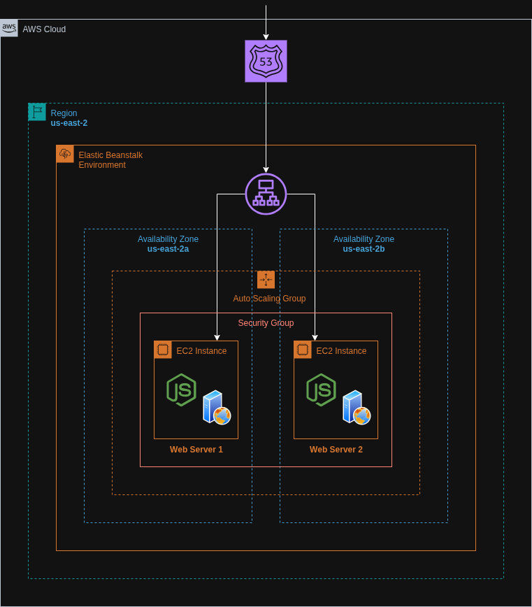

# Node.js Application Deployment on AWS Elastic Beanstalk using Terraform

Automated deployment of a Node.js application on AWS Elastic Beanstalk using Terraform. The setup provisions all required AWS resources, including S3 for storing deployment packages, IAM roles for environment control, and Elastic Beanstalk environment configuration for scalable app hosting.


## Architecture Diagram




## Live Access

Once deployed, the Node.js app will be accessible via the Elastic Beanstalk environment URL provided in the Terraform output.


## Features

- Node.js application hosted on AWS Elastic Beanstalk
- Terraform-managed provisioning and configuration
- S3 bucket for application version storage
- IAM roles and policies for Elastic Beanstalk management
- Full lifecycle control via `terraform apply` and `terraform destroy`
- Custom environment variables, scaling configuration, and health checks
- Optional CloudWatch alarms for observability and uptime monitoring


## Run Locally

Clone the project:

```bash
git clone https://github.com/haiderzaidi07/aws-exercises.git
```

Navigate into the Elastic Beanstalk project directory:

```bash
cd task11
```

Initialize Terraform:

```bash
terraform init
```

Apply the configuration:

```bash
terraform apply
```

⚠️ Ensure your AWS CLI is configured and the IAM user has sufficient permissions for Elastic Beanstalk and S3.

To clean up after completion:

```bash
terraform destroy
```


## File Structure

```bash
.
├── main.tf                   # Root module to define application, environment, and dependencies
├── variables.tf              # Input variables for customization
├── outputs.tf                # Output environment URL and other values
├── terraform.tfvars          # Variable values for deployment
├── create_app_zip.sh         # Script for generating zip archive
├── README.md

├── beanstalk/
│   ├── main.tf               # Elastic Beanstalk application, environment and application version
│   ├── variables.tf
│   └── outputs.tf
│
├── s3/
│   ├── main.tf               # S3 bucket, object and zip file provisioner
│   ├── variables.tf
│   └── outputs.tf
│
├── iam/
│   ├── main.tf               # Elastic Beanstalk service role and EC2 instance profile
│   ├── variables.tf
│   └── outputs.tf
│
└── app/                      # Your Node.js application folder
    ├── node_modules/
    ├── package-lock.json
    ├── package.json
    ├── server.js             # Main application entry
    └── haider-eb-nodejs.zip  # Zipped archive used by Terraform for EB deployment
```


## Lessons Learned

* Learned how to package and deploy a Node.js app using Elastic Beanstalk and Terraform
* Understood Elastic Beanstalk’s environment structure and how it manages application versions
* Configured IAM roles for secure deployment management
* Managed environment variables and scaling settings through code
* Used S3 as an intermediate store for application bundles


## Further Optimizations

* Automate zip packaging and S3 upload in a CI/CD pipeline
* Add HTTPS support using Elastic Load Balancer and ACM certificates
* Fine-tune scaling policies and instance types
* Add CloudWatch alarms for monitoring CPU, latency, and error rates
* Separate state management using remote Terraform backends (e.g., S3 with DynamoDB locking)