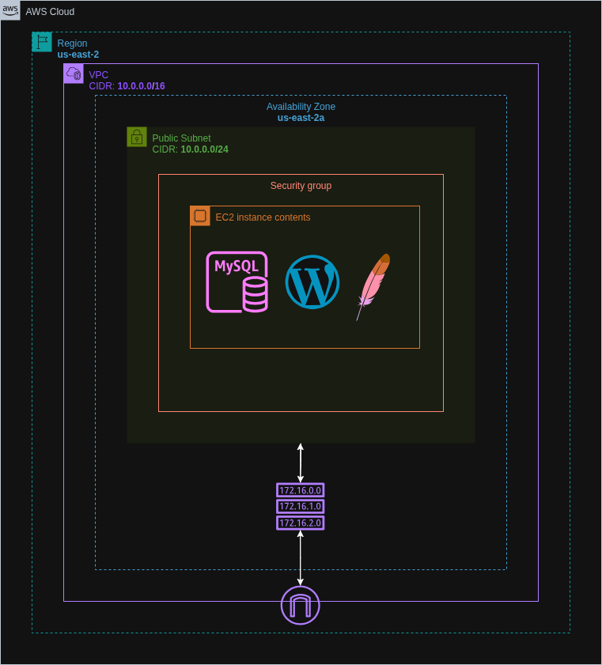

# Wordpress Deployment with Terraform

Provisioned an EC2 instance using Terraform to host a WordPress website with a MySQL database on the same instance. The deployment is fully automated using a user data script.


## Architecture Diagram



## Live Access

You can access the WordPress setup page via the public IP provided by Terraform after deployment.


## Features

- One-click WordPress deployment using Terraform
- Automated Apache, PHP, and MySQL installation via EC2 User Data
- Persistent infrastructure as code (IaC)


## Run Locally

Clone the project:

```bash
git clone https://github.com/haiderzaidi07/aws-exercises.git
```

Navigate into the project directory:

```bash
cd task2
```

Initialize Terraform:

```bash
terraform init
```

Preview the infrastructure plan:

```bash
terraform plan
```

Apply the configuration to deploy:

```bash
terraform apply
```

⚠️ Make sure your AWS CLI is configured with valid credentials before running the above commands.

Clean up after completion:

```bash
terraform destroy
```

## File Structure

```bash
.
├── main.tf             # Configures AWS provider, EC2 instance, VPC and SG
├── variables.tf        # Holds all configurable parameters
├── outputs.tf          # Displays public IP of the EC2 instance after provisioning
├── terraform.tfvars    # Contains values of the variables in variables.tf 
├── user_data.sh        # Bash script for installing WordPress and its dependencies
└── README.md
```


## Lessons Learned

- Gained hands-on experience with Terraform to provision AWS resources

- Learned to use user data for server initialization


## Further Optimizations

- Utilising Modular Approach in Terraform for reusability