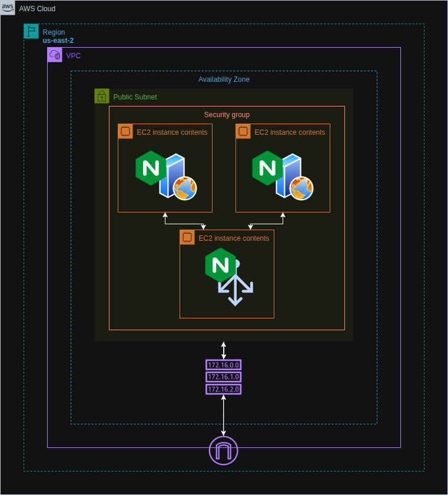

# NGINX Load Balancer Setup on AWS EC2

Provisioned an NGINX load balancer on an EC2 instance using Terraform to distribute HTTP traffic between two backend EC2 instances running simple web servers. The setup is documented step-by-step with explanations and screenshots.


## Architecture Diagram




## Live Access

You can access the load balancer via the public IP of the Load Balancer EC2, provided by Terraform after deployment. Refresh the page multiple times to see responses from different backend servers.


## Features

- Automated provisioning of all EC2 instances using Terraform
- NGINX configured as a reverse proxy/load balancer
- Backend web servers return different responses to verify distribution
- Separation of concerns: load balancer and backend instances


## Run Locally

Clone the project:

```bash
git clone https://github.com/haiderzaidi07/aws-exercises.git
````

Navigate into the project directory:

```bash
cd task4
```

Initialize Terraform:

```bash
terraform init
```

Preview the infrastructure plan:

```bash
terraform plan
```

Apply the configuration to deploy:

```bash
terraform apply
```

⚠️ Make sure your AWS CLI is configured with valid credentials before running the above commands.

Clean up after completion:

```bash
terraform destroy
```


## File Structure

```bash
.
├── main.tf             # Defines AWS provider, 3 EC2 instances, security groups
├── nginx.conf          # Defines Nginx configuration for Load Balancer and Reverse Proxy
└── README.md
```

<!---
├── variables.tf        # Holds configurable parameters
├── outputs.tf          # Outputs public IP of the NGINX load balancer instance
├── terraform.tfvars    # Contains actual values for defined variables
├── user_data_lb.sh     # Installs and configures NGINX as a load balancer
├── user_data_web.sh    # Installs a simple web server with unique response
-->


## Lessons Learned

* Gained hands-on experience configuring NGINX as a load balancer
* Learned how to manage multiple EC2 instances with Terraform


## Further Optimizations

* Add health checks in NGINX to avoid routing to unhealthy backends
* Enable HTTPS through SSL certificates
* Utilise Modular Approach in Terraform for reusability
* Create separate user data files for backend servers and load balancer
* Use multiple subnets for high availability

<!--- * Replace backend EC2s with an Auto Scaling Group behind a Target Group
* Use Application Load Balancer (ALB) or Network Load Balancer (NLB) for managed traffic distribution
* Integrate with Route 53 for DNS-based access to the load balancer
-->