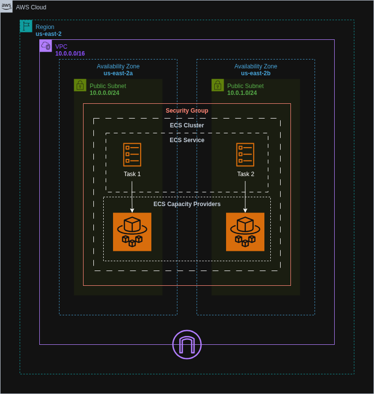

# ECS Fargate NGINX Server Deployment with Terraform

Deployed an NGINX web server using Amazon ECS Fargate, fully managed through Terraform using modular approach. The setup includes custom networking, IAM roles, task definitions, and an ECS service configured with minimal overhead.


## Architecture Diagram




## Live Access

You can access the NGINX server via the public IP or DNS name provided by Terraform after the deployment.


## Features

- Infrastructure as Code using Terraform with modular approach
- Fully serverless compute with Amazon ECS Fargate
- Custom VPC and public subnets for ECS tasks
- IAM roles and policies for ECS task execution
- NGINX container deployed and exposed over HTTP


## Run Locally

Clone the project:

```bash
git clone https://github.com/haiderzaidi07/aws-exercises.git
````

Navigate into the project directory:

```bash
cd task5
```

Initialize Terraform:

```bash
terraform init
```

Preview the infrastructure plan:

```bash
terraform plan
```

Apply the configuration to deploy:

```bash
terraform apply
```

⚠️ Make sure your AWS CLI is configured with valid credentials before running the above commands.

Clean up after completion:

```bash
terraform destroy
```


## File Structure

```bash
.
├── main.tf                   # Root module to wire up all child modules
├── variables.tf              # Root-level variables
├── outputs.tf                # Root-level outputs
├── terraform.tfvars          # Root-level variable values
├── README.md                 

├── iam/
│   ├── main.tf               # IAM roles and policies for ECS
│   ├── variables.tf
│   └── outputs.tf
│
├── vpc/
│   ├── main.tf               # VPC, subnets, route table and igw
│   ├── variables.tf
│   └── outputs.tf
│
├── ecs/
│   ├── main.tf               # ECS cluster, service, task definition
│   ├── variables.tf
│   └── outputs.tf
│
└── sg/
    ├── main.tf               # Security group and rules
    ├── variables.tf
    └── outputs.tf
```


## Lessons Learned

* Gained hands-on experience with ECS Fargate and Terraform
* Understood how to write ECS task definitions and services declaratively
* Learned how to structure and assign IAM roles to ECS tasks
* Saw how containerized workloads can be managed without provisioning servers


## Further Optimizations

* Add an Application Load Balancer for dynamic scaling and health checks
* Configure auto-scaling policies based on CPU or memory usage
* Implement HTTPS with AWS ACM and ALB listener rules