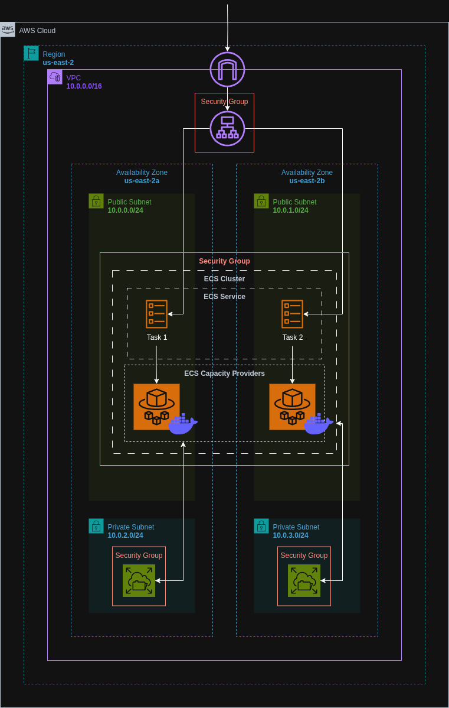

# ECS Fargate NGINX Deployment with ALB and EFS using Terraform

Set up a highly available, scalable, and persistent NGINX server infrastructure on Amazon ECS Fargate using Terraform. This setup includes a custom VPC with public and private subnets, an Application Load Balancer (ALB), Amazon Elastic File System (EFS) for persistent storage, and ECS tasks based on a custom Docker image stored in Amazon ECR.


## Architecture Diagram




## Live Access

Once deployed, the NGINX server can be accessed via the DNS name of the Application Load Balancer provided in the Terraform output.


## Features

- Modular infrastructure using Terraform
- Highly available architecture across multiple Availability Zones
- Application Load Balancer for traffic distribution and health checks
- Amazon EFS integration for persistent volume mounts
- ECS Fargate launch type for serverless container hosting
- Custom Docker image built, pushed to ECR, and deployed in ECS
- Fine-grained IAM roles and security groups for each component


## Run Locally

Clone the project:

```bash
git clone https://github.com/haiderzaidi07/aws-exercises.git
```

Navigate into the project directory:

```bash
cd task6
```

Initialize Terraform:

```bash
terraform init
```

Preview the infrastructure plan:

```bash
terraform plan
```

Apply the configuration to deploy:

```bash
terraform apply
```

⚠️ Ensure your AWS CLI is configured, Docker is installed, and you are authenticated to Amazon ECR before running the above commands.

Clean up after completion:

```bash
terraform destroy
```


## File Structure

```bash
.
├── main.tf                   # Root module to wire up all child modules
├── variables.tf              # Root-level variables
├── outputs.tf                # Root-level outputs
├── terraform.tfvars          # Root-level variable values
├── README.md                 

├── iam/
│   ├── main.tf               # IAM roles and policies for ECS
│   ├── variables.tf
│   └── outputs.tf
│
├── alb/
│   ├── main.tf               # ALB, ALB listener and target group
│   ├── variables.tf
│   └── outputs.tf
│
├── ecr/
│   ├── main.tf               # ECR repository and push commands for Docker image
│   ├── variables.tf
│   └── outputs.tf
│
├── efs/
│   ├── main.tf               # EFS and mount targets
│   ├── variables.tf
│   └── outputs.tf
│
├── vpc/
│   ├── main.tf               # VPC, subnets, route tables, NAT gateway, IGW
│   ├── variables.tf
│   └── outputs.tf
│
├── ecs/
│   ├── main.tf               # ECS cluster, task definition, service, ECR image, EFS mount
│   ├── variables.tf
│   └── outputs.tf
│
└── sg/
    ├── main.tf               # Security groups for ALB, ECS, and EFS
    ├── variables.tf
    └── outputs.tf
```


## Lessons Learned

* Designed a multi-AZ network topology using Terraform
* Gained hands-on experience with ECS Fargate task definitions and volume mounting
* Learned how to integrate an ALB with ECS for dynamic load balancing
* Configured EFS volumes for stateful applications using Fargate
* Understood IAM permissions, modular Terraform structure, and scalable deployment patterns


## Further Optimizations

* Add auto-scaling for ECS services based on CPU and memory metrics
* Enable HTTPS termination on the ALB using ACM
* Set up CloudWatch Alarms and custom dashboards for ECS/EFS monitoring
* Integrate CI/CD pipelines for Docker image build and ECS deployment
