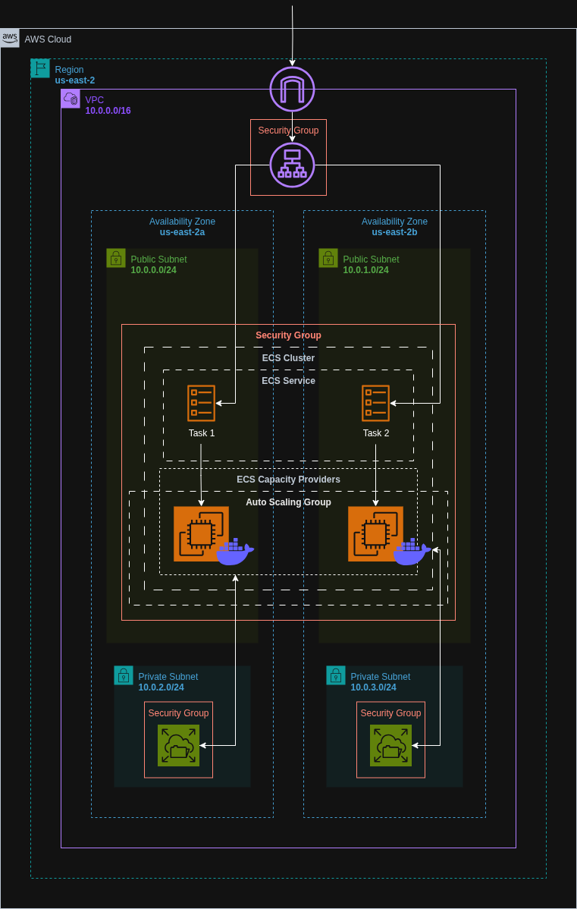

# ECS EC2 NGINX Deployment with EFS, ALB and ASG using Terraform

Provisioned an ECS cluster using the EC2 launch type through an Auto Scaling Group (ASG) to run an NGINX container with persistent storage via Amazon EFS. The setup includes a VPC with public and private subnets, Application Load Balancer (ALB), CloudWatch Logs for monitoring, and fine-grained IAM roles—managed entirely through Terraform.


## Architecture Diagram




## Live Access

Once deployed, the NGINX server is accessible via the ALB DNS name provided in the Terraform output.


## Features

- ECS cluster with EC2 launch type using ASG
- NGINX container deployed on EC2-backed container instances
- Amazon EFS mounted on ECS containers for persistent file storage
- ALB for high availability and load balancing
- Full CloudWatch integration for logs and observability
- IAM roles and policies for EC2, ECS, EFS, ALB, and CloudWatch
- Modular, reusable Terraform setup


## Run Locally

Clone the project:

```bash
git clone https://github.com/haiderzaidi07/aws-exercises.git
````

Navigate into the project directory:

```bash
cd task7
```

Initialize Terraform:

```bash
terraform init
```

Preview the infrastructure plan:

```bash
terraform plan
```

Apply the configuration to deploy:

```bash
terraform apply
```

⚠️ Ensure your AWS CLI is configured and you are authenticated to Amazon ECR if you're pushing a custom Docker image.

Clean up after completion:

```bash
terraform destroy
```


## File Structure

```bash
.
├── main.tf                   # Root module to wire up all child modules
├── variables.tf              # Root-level variables
├── outputs.tf                # Root-level outputs
├── terraform.tfvars          # Root-level variable values
├── README.md                 

├── iam/
│   ├── main.tf               # IAM roles and policies for ECS
│   ├── variables.tf
│   └── outputs.tf
│
├── alb/
│   ├── main.tf               # ALB, ALB listener and target group
│   ├── variables.tf
│   └── outputs.tf
│
├── asg/
│   ├── main.tf               # Instance launch template, ASG and ECS cluster
│   ├── variables.tf
│   └── outputs.tf
│
├── ecr/
│   ├── main.tf               # ECR repository and push commands for Docker image
│   ├── variables.tf
│   └── outputs.tf
│
├── efs/
│   ├── main.tf               # EFS and mount targets
│   ├── variables.tf
│   └── outputs.tf
│
├── vpc/
│   ├── main.tf               # VPC, subnets, route tables, IGW
│   ├── variables.tf
│   └── outputs.tf
│
├── ecs/
│   ├── main.tf               # ECS capacity provider, task definition, service, EFS mount
│   ├── variables.tf
│   └── outputs.tf
│
└── sg/
    ├── main.tf               # Security groups for ALB, ECS, and EFS
    ├── variables.tf
    └── outputs.tf
```


## Lessons Learned

* Learned how to deploy ECS services with the EC2 launch type and manage capacity manually
* Integrated persistent storage using EFS with ECS-backed EC2 containers
* Implemented CloudWatch Logs for centralized observability of container logs
* Understood how to write reusable, modular Terraform code for infrastructure provisioning


## Further Optimizations

* Integrate HTTPS termination on ALB using ACM
* Attach Elastic IPs to bastion hosts or public EC2s for SSH access
* Add lifecycle policies for log rotation and EFS backup
* Move Docker image build to CI/CD pipeline and automate ECR push