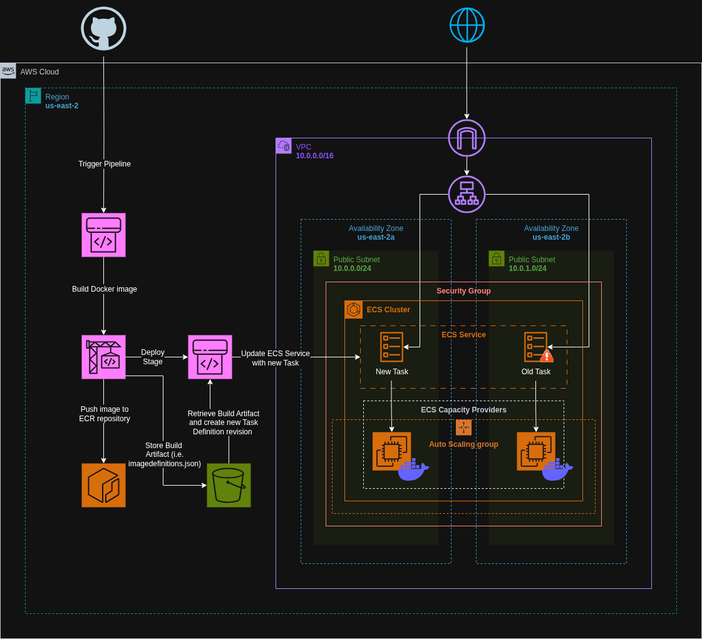

# Deploying an Application on ECS EC2 using AWS CodePipeline (Manual Setup)

Set up AWS CodePipeline via the AWS Console to automate CI/CD for an application deployed on Amazon ECS using EC2 launch type.


## Architecture Diagram




## Steps Overview

- **Set up an ECS cluster with EC2 launch type**
- **Launch and configure EC2 instances in the ECS cluster**
- **Create a Docker image for the application and push it to Amazon ECR**
- **Create an ECS task definition referencing the Docker image**
- **Create or configure an ECS service to run the task definition on the cluster**
- **Set up an Application Load Balancer (ALB) to distribute traffic to ECS tasks**
- **Create an IAM role for AWS CodePipeline with necessary permissions**
- **Configure AWS CodePipeline with stages: Source, Build, and Deploy**
- **Connect the Source stage to your code repository (e.g., GitHub, CodeCommit)**
- **Configure the Build stage using AWS CodeBuild to build and push the Docker image**
- **Set up the Deploy stage to update ECS service with the new task definition**
- **Manually trigger and monitor the pipeline execution for deployment**
- **Verify the application is running successfully on ECS through the ALB**


## CI/CD Pipeline Flow

```text
[Source: GitHub]
        ↓
[Build: AWS CodeBuild]
        ↓
[Deploy: Amazon ECS]
        ↓
[Run Task Definition with EC2 Launch Type]
        ↓
[Application Served via ALB]
```


## Key Components

* **Amazon ECR**: Container registry to store the application Docker image.
* **Amazon ECS (EC2)**: Container orchestration service using EC2 launch type.
* **ALB**: Routes incoming traffic to ECS tasks.
* **CodePipeline**: Orchestrates CI/CD stages.
* **CodeBuild**: Builds Docker images and pushes them to ECR.


## Notes

* Ensure ECS EC2 instances have the proper IAM role (`ecsInstanceRole`) attached.
* The ECS service should be configured to use the ALB target group for traffic routing.
* CodeBuild project should contain a `buildspec.yml` that builds and pushes the Docker image to ECR and registers a new ECS task definition.
* The deploy stage in CodePipeline should use the "Amazon ECS" provider and reference the correct ECS service and cluster.