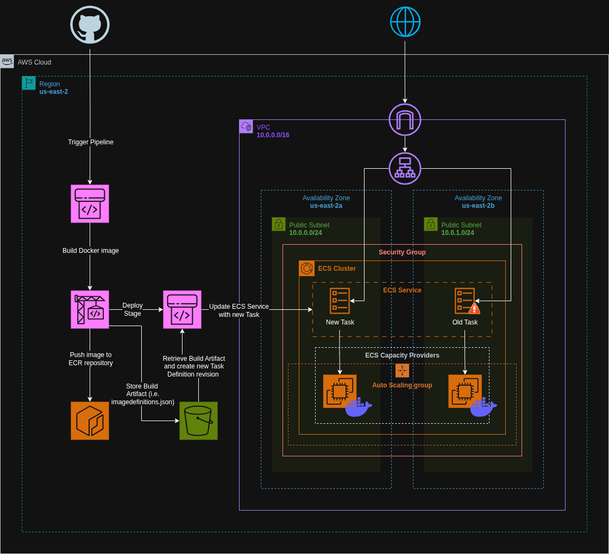

# ECS EC2 Deployment with CodePipeline CI/CD using Terraform

Provisioned an ECS cluster using the EC2 launch type with Auto Scaling Group (ASG) and integrated a full CI/CD pipeline using AWS CodePipeline and CodeBuild. Docker images are built and pushed to ECR, and ECS services are automatically updated—all managed via modular Terraform code.


## Architecture Diagram




## Live Access

Once deployed, the application is accessible via the ALB DNS name provided in the Terraform output.


## Features

- ECS Cluster with EC2 launch type using ASG
- Auto Scaling Group to manage container instances
- Application Load Balancer for traffic distribution
- Docker images stored in Amazon ECR
- Full CI/CD pipeline using CodePipeline and CodeBuild
- IAM roles and policies for ECS, CodeBuild, CodePipeline, ECR, and ALB
- Modular, reusable Terraform code


## Run Locally

Clone the project:

```bash
git clone https://github.com/haiderzaidi07/aws-exercises.git
````

Navigate into the project directory:

```bash
cd task9
```

Initialize Terraform:

```bash
terraform init
```

Preview the infrastructure plan:

```bash
terraform plan
```

Apply the configuration to deploy:

```bash
terraform apply
```

⚠️ Ensure your AWS CLI is configured and authenticated to both GitHub (if applicable) and Amazon ECR.

Clean up after completion:

```bash
terraform destroy
```


## File Structure

```bash
.
├── main.tf                     # Root module to wire up all child modules
├── variables.tf                # Root-level variables
├── outputs.tf                  # Root-level outputs
├── terraform.tfvars            # Root-level variable values
├── buildspec.yml               # Build instructions
├── Dockerfile                  # Dockerfile used to build image
├── ecs.sh                      # Script for linking ECS cluster with EC2 instances
├── README.md

├── vpc/
│   ├── main.tf                 # VPC, public subnets, route tables
│   ├── variables.tf
│   └── outputs.tf
│
├── sg/
│   ├── main.tf                 # Security groups for ECS, ALB, CodeBuild
│   ├── variables.tf
│   └── outputs.tf
│
├── asg/
│   ├── main.tf                 # Launch template, Auto Scaling Group, ECS cluster
│   ├── variables.tf
│   └── outputs.tf
│
├── alb/
│   ├── main.tf                 # Application Load Balancer and target groups
│   ├── variables.tf
│   └── outputs.tf
│
├── ecs/
│   ├── main.tf                 # ECS task definition, service, and capacity provider
│   ├── variables.tf
│   └── outputs.tf
│
├── ecr/
│   ├── main.tf                 # ECR repository for Docker image
│   ├── variables.tf
│   └── outputs.tf
│
├── iam/
│   ├── main.tf                 # IAM roles for ECS, CodeBuild, CodePipeline
│   ├── variables.tf
│   └── outputs.tf
│
├── codebuild/
│   ├── main.tf                 # CodeBuild project for Docker image build/push
│   ├── variables.tf
│   └── outputs.tf
│
└── codepipeline/
    ├── main.tf                 # CodePipeline with Source, Build, and Deploy stages
    ├── variables.tf
    └── outputs.tf
```


## Lessons Learned

* Gained hands-on experience automating CI/CD pipelines with AWS CodePipeline
* Understood how CodeBuild builds Docker images and pushes them to ECR
* Learned how to automatically trigger ECS service updates via new task definitions
* Practiced writing modular Terraform for end-to-end deployment workflows


## Further Optimizations

* Add approval stage between build and deploy in CodePipeline
* Enable GitHub webhook triggers for real-time CI/CD
* Add monitoring for CodePipeline and CodeBuild stages via CloudWatch Events
* Include ECS blue/green deployments via CodeDeploy integration